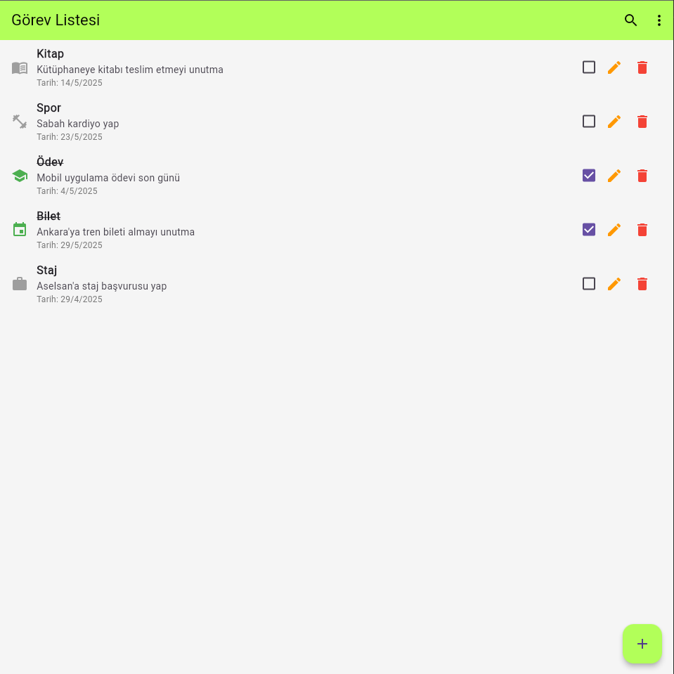

# 📝 Todo App

A modern Flutter-based todo list application with Firebase Firestore integration.

## 🚀 Features

- 📌 Add, edit, and delete tasks  
- ✅ Mark tasks as completed  
- 🔍 Search tasks by title or subtitle  
- 📅 Select due dates for tasks  
- 🧠 Choose category icons (work, school, shopping, etc.)  
- 🔄 Real-time sync with Firebase Firestore  
- 🔃 Filter tasks by status: All, Completed, Pending  

## 📷 Screenshot

